<p align="center">
  <strong>AudioSurvey AI</strong><br/>
  <em>AI-Powered Multilingual IVR Voice Survey Platform</em>
</p>

<p align="center">
  <code>Version 1.0.0</code> &nbsp;|&nbsp; <code>Last Updated: 2026-03-20</code> &nbsp;|&nbsp; <code>Classification: Internal</code>
</p>

---

# Project Documentation

## Table of Contents

| # | Section | Description |
|---|---------|-------------|
| 1 | [Executive Summary](#1-executive-summary) | High-level project overview and objectives |
| 2 | [System Architecture](#2-system-architecture) | Architecture diagrams, component topology, tech stack |
| 3 | [Component Design](#3-component-design) | Deep dive into each module and its responsibilities |
| 4 | [Data Flow & Pipelines](#4-data-flow--pipelines) | End-to-end data lifecycle and ML processing pipeline |
| 5 | [API Reference](#5-api-reference) | Complete HTTP endpoint documentation |
| 6 | [Data Models & State Schema](#6-data-models--state-schema) | JSON schemas, state machine, data persistence |
| 7 | [Authentication & Security](#7-authentication--security) | Auth flow, brute-force protection, session management |
| 8 | [Survey Question Engine](#8-survey-question-engine) | Question format specification and IVR call flow |
| 9 | [Configuration Reference](#9-configuration-reference) | All configuration files and environment variables |
| 10 | [Admin Dashboard](#10-admin-dashboard) | UI features, live polling, user workflows |
| 11 | [Background Services](#11-background-services) | Scheduler, ML worker, and concurrency model |
| 12 | [Error Handling & Resilience](#12-error-handling--resilience) | Fault tolerance, retry logic, graceful degradation |
| 13 | [Logging & Observability](#13-logging--observability) | Logging architecture, audit trails, monitoring |
| 14 | [Deployment Guide](#14-deployment-guide) | Local setup, ngrok tunneling, macOS DMG packaging |
| 15 | [Directory Structure](#15-directory-structure) | Complete project tree with annotations |
| 16 | [Dependency Matrix](#16-dependency-matrix) | Third-party libraries and their roles |
| 17 | [Glossary](#17-glossary) | Domain terminology and abbreviations |

---

## 1. Executive Summary

### 1.1 Purpose

AudioSurvey AI is an AI-powered multilingual Interactive Voice Response (IVR) survey platform designed to conduct automated voice-based research surveys over telephone calls. The system targets populations in **Swahili-speaking regions** (primarily Kenya/Tanzania), enabling researchers to collect structured survey responses at scale without requiring in-person enumerators.

### 1.2 Business Context

The platform was built for academic/public health research — specifically to evaluate the impact of educational video content ("MADO na Zamba") on attitudes toward **family planning, reproductive health, and gender norms**. The survey instrument contains ~50 questions across 5 thematic sections.

### 1.3 Key Capabilities

| Capability | Description |
|------------|-------------|
| **Automated Outbound Calling** | Scheduled batch dialing of research participants via Twilio |
| **Inbound Call Support** | Participants can call in and complete the survey |
| **Multilingual IVR** | Survey prompts spoken in Kiswahili via Azure Neural TTS |
| **Multi-Format Questions** | INFO, OPEN (speech), MCQ (DTMF keypad), MCQO (MCQ + "Other" speech) |
| **Full-Call Recording** | Complete audio capture of every call (up to 30 minutes) |
| **AI Audio Processing** | Background noise removal via DeepFilterNet |
| **Speech-to-Text** | Post-call transcription using OpenAI Whisper (large-v3) |
| **Machine Translation** | Automatic Kiswahili → English translation |
| **English Audio Generation** | TTS synthesis of translated responses |
| **Structured Data Export** | Excel export of MCQ/MCQO responses (original + English) |
| **Admin Dashboard** | Real-time web UI for managing participants, scheduling, and monitoring |
| **Conference Calling** | Three-way call support for researcher-moderated interviews |
| **macOS Distribution** | Packaged as a native .app inside a DMG installer |

### 1.4 Technology Summary

| Layer | Technology |
|-------|-----------|
| **Runtime** | Python 3.x |
| **Web Framework** | Flask 3.1.2 |
| **Telephony** | Twilio Voice API |
| **Live Speech Recognition** | Twilio `<Gather>` (Kiswahili `sw-KE`) |
| **Post-Call Transcription** | OpenAI Whisper `large-v3` |
| **Text-to-Speech (Prompts)** | Azure Cognitive Services (Neural SSML) |
| **Text-to-Speech (Output)** | Google TTS (gTTS) |
| **Translation** | Google Translate (googletrans) |
| **Noise Reduction** | DeepFilterNet (PyTorch-based) |
| **Audio Processing** | FFmpeg, pydub |
| **Data Export** | pandas + openpyxl |
| **Tunneling** | ngrok |
| **Packaging** | macOS .app bundle + DMG |

---

## 2. System Architecture

### 2.1 High-Level Architecture

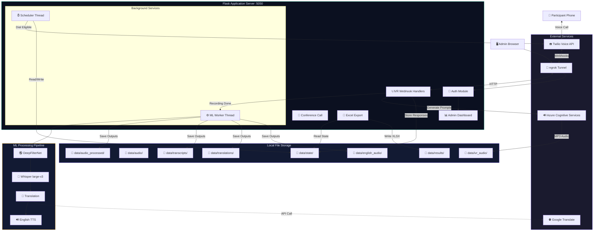
```mermaid
graph TB
    subgraph External["External Services"]
        TWILIO["☎️ Twilio Voice API"]
        AZURE["🔊 Azure Cognitive Services"]
        GOOGLE["🌐 Google Translate"]
        NGROK["🔗 ngrok Tunnel"]
    end

    subgraph Server["Flask Application Server :5050"]
        direction TB
        AUTH["🔐 Auth Module"]
        IVR["📞 IVR Webhook Handlers"]
        DASH["📊 Admin Dashboard"]
        CONF["🤝 Conference Call"]
        EXPORT["📄 Excel Export"]

        subgraph BackgroundServices["Background Services"]
            SCHED["⏰ Scheduler Thread"]
            WORKER["⚙️ ML Worker Thread"]
        end
    end

    subgraph MLPipeline["ML Processing Pipeline"]
        DENOISE["🔇 DeepFilterNet"]
        WHISPER["🎤 Whisper large-v3"]
        TRANSLATE["🔄 Translation"]
        TTS["🔊 English TTS"]
    end

    subgraph Storage["Local File Storage"]
        STATE["📁 data/state/"]
        AUDIO["📁 data/audio/"]
        PROCESSED["📁 data/audio_processed/"]
        TRANSCRIPTS["📁 data/transcripts/"]
        TRANSLATIONS["📁 data/translations/"]
        EN_AUDIO["📁 data/english_audio/"]
        RESULTS["📁 data/results/"]
        IVR_AUDIO["📁 data/ivr_audio/"]
    end

    PHONE["📱 Participant Phone"] <-->|Voice Call| TWILIO
    TWILIO <-->|Webhooks| NGROK
    NGROK <-->|HTTP| IVR
    BROWSER["🖥️ Admin Browser"] --> NGROK
    NGROK --> AUTH --> DASH

    IVR -->|Generate Prompts| AZURE
    AZURE -->|MP3 Audio| IVR_AUDIO
    IVR -->|Recording Done| WORKER
    WORKER --> DENOISE --> WHISPER --> TRANSLATE --> TTS
    TRANSLATE -.->|API Call| GOOGLE

    SCHED -->|Dial Eligible| TWILIO
    SCHED -->|Read/Write| STATE
    IVR -->|Store Responses| STATE
    WORKER -->|Save Outputs| PROCESSED & TRANSCRIPTS & TRANSLATIONS & EN_AUDIO
    EXPORT -->|Read State| STATE
    EXPORT -->|Write XLSX| RESULTS

    style External fill:#1a1a2e,stroke:#7c5cff,color:#e8ecff
    style Server fill:#0b1020,stroke:#20c997,color:#e8ecff
    style MLPipeline fill:#121a33,stroke:#f59f00,color:#e8ecff
    style Storage fill:#121a33,stroke:#7c5cff,color:#e8ecff
```

### 2.2 Network Topology

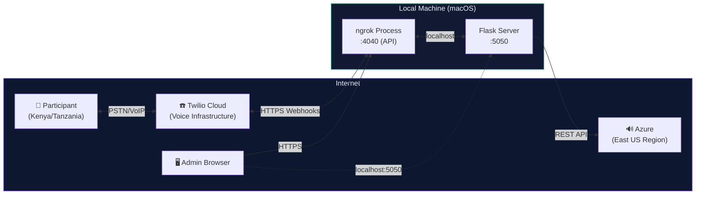
```mermaid
graph LR
    subgraph Internet
        PARTICIPANT["📱 Participant<br/>(Kenya/Tanzania)"]
        TWILIO_CLOUD["☎️ Twilio Cloud<br/>(Voice Infrastructure)"]
        AZURE_CLOUD["🔊 Azure<br/>(East US Region)"]
        ADMIN_USER["🖥️ Admin Browser"]
    end

    subgraph LocalMachine["Local Machine (macOS)"]
        NGROK_PROC["ngrok Process<br/>:4040 (API)"]
        FLASK["Flask Server<br/>:5050"]
    end

    PARTICIPANT <-->|PSTN/VoIP| TWILIO_CLOUD
    TWILIO_CLOUD <-->|HTTPS Webhooks| NGROK_PROC
    NGROK_PROC <-->|localhost| FLASK
    FLASK -->|REST API| AZURE_CLOUD
    ADMIN_USER -->|HTTPS| NGROK_PROC
    ADMIN_USER -.->|localhost:5050| FLASK

    style Internet fill:#0d1830,stroke:#7c5cff,color:#e8ecff
    style LocalMachine fill:#121a33,stroke:#20c997,color:#e8ecff
```

### 2.3 Thread Architecture

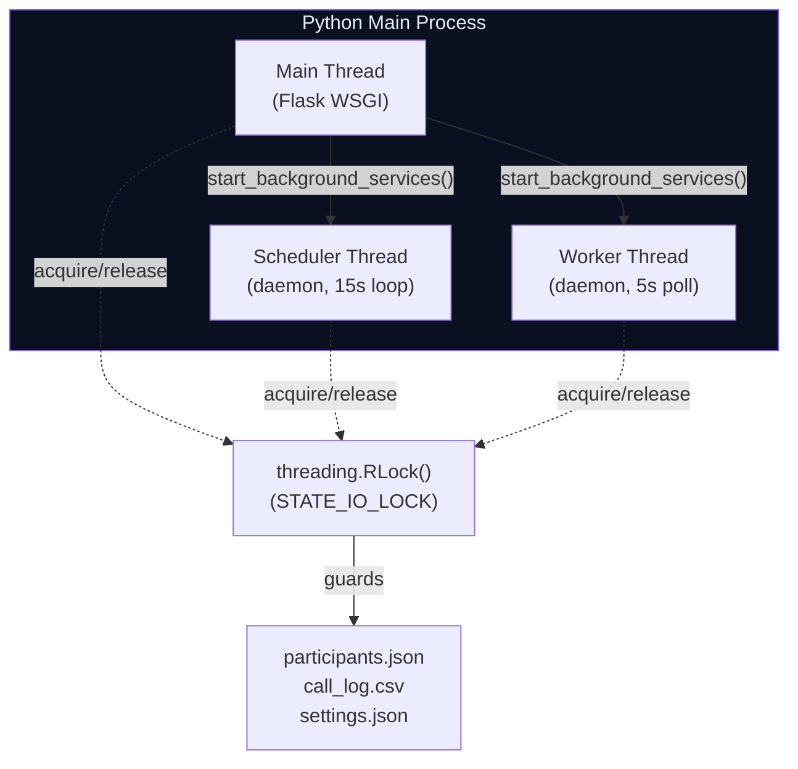
```mermaid
graph TB
    subgraph MainProcess["Python Main Process"]
        MAIN["Main Thread<br/>(Flask WSGI)"]
        SCHED_T["Scheduler Thread<br/>(daemon, 15s loop)"]
        WORKER_T["Worker Thread<br/>(daemon, 5s poll)"]
    end

    MAIN -->|"start_background_services()"| SCHED_T
    MAIN -->|"start_background_services()"| WORKER_T

    LOCK["threading.RLock()<br/>(STATE_IO_LOCK)"]

    MAIN -.->|acquire/release| LOCK
    SCHED_T -.->|acquire/release| LOCK
    WORKER_T -.->|acquire/release| LOCK

    LOCK -->|guards| FILE["participants.json<br/>call_log.csv<br/>settings.json"]

    style MainProcess fill:#0b1020,stroke:#7c5cff,color:#e8ecff
```

---

## 3. Component Design

### 3.1 Module Dependency Graph

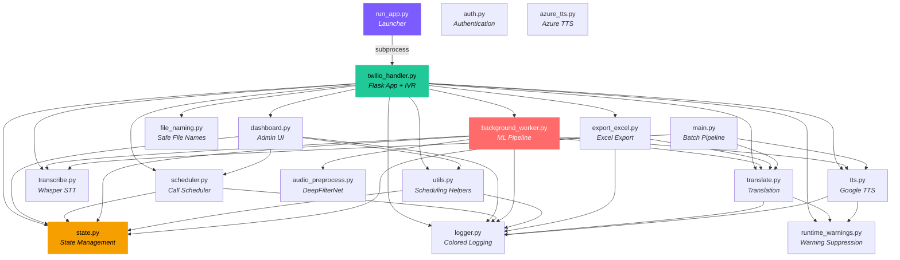
```mermaid
graph TD
    RUN["run_app.py<br/><i>Launcher</i>"]
    MAIN["main.py<br/><i>Batch Pipeline</i>"]

    TH["twilio_handler.py<br/><i>Flask App + IVR</i>"]
    DASH["dashboard.py<br/><i>Admin UI</i>"]
    SCHED["scheduler.py<br/><i>Call Scheduler</i>"]
    BW["background_worker.py<br/><i>ML Pipeline</i>"]

    STATE["state.py<br/><i>State Management</i>"]
    UTILS["utils.py<br/><i>Scheduling Helpers</i>"]
    AUTH["auth.py<br/><i>Authentication</i>"]
    FN["file_naming.py<br/><i>Safe File Names</i>"]

    TRANS["transcribe.py<br/><i>Whisper STT</i>"]
    TRANSLATE["translate.py<br/><i>Translation</i>"]
    TTS["tts.py<br/><i>Google TTS</i>"]
    AP["audio_preprocess.py<br/><i>DeepFilterNet</i>"]
    AZTTS["azure_tts.py<br/><i>Azure TTS</i>"]

    EXPORT["export_excel.py<br/><i>Excel Export</i>"]
    LOG["logger.py<br/><i>Colored Logging</i>"]
    RW["runtime_warnings.py<br/><i>Warning Suppression</i>"]

    RUN -->|subprocess| TH
    TH --> DASH
    TH --> SCHED
    TH --> BW
    TH --> STATE
    TH --> UTILS
    TH --> FN
    TH --> TRANS
    TH --> TRANSLATE
    TH --> TTS
    TH --> EXPORT
    TH --> LOG
    TH --> RW

    DASH --> STATE
    DASH --> UTILS
    DASH --> SCHED
    DASH --> LOG

    SCHED --> STATE
    SCHED --> LOG

    BW --> AP
    BW --> TRANS
    BW --> TRANSLATE
    BW --> TTS
    BW --> STATE
    BW --> LOG

    UTILS --> STATE
    UTILS --> LOG

    EXPORT --> STATE
    EXPORT --> TRANSLATE
    EXPORT --> LOG

    MAIN --> TRANS
    MAIN --> TRANSLATE
    MAIN --> TTS

    TRANSLATE --> RW
    TRANSLATE --> LOG
    TTS --> RW
    TTS --> LOG

    style RUN fill:#7c5cff,stroke:#7c5cff,color:#fff
    style TH fill:#20c997,stroke:#20c997,color:#000
    style STATE fill:#f59f00,stroke:#f59f00,color:#000
    style BW fill:#ff6b6b,stroke:#ff6b6b,color:#fff
```

### 3.2 Module Descriptions

| Module | Lines | Responsibility |
|--------|-------|---------------|
| `twilio_handler.py` | ~1,330 | Core Flask application. Defines all IVR webhook routes, Azure TTS for call prompts, auth login/logout flows, conference calling, recording download, and application bootstrap. Acts as the central orchestrator. |
| `dashboard.py` | ~950 | Admin web dashboard. Renders the single-page HTML UI with inline CSS/JS. Handles participant management routes (upload, schedule, pause/resume, reset, dial now). Includes live-polling JSON endpoint. |
| `state.py` | ~240 | Thread-safe participant state management. Handles JSON persistence with atomic writes, call eligibility logic (`can_call`), state transitions, retry gap enforcement, and participant schema migration. |
| `export_excel.py` | ~310 | Builds structured Excel exports from participant responses. Decodes DTMF digits back to option text, filters out OPEN responses, supports both original-language and English-translated exports. |
| `background_worker.py` | ~150 | Continuous polling worker that processes completed recordings through the 4-stage ML pipeline (denoise → transcribe → translate → TTS). Shows terminal progress bars. |
| `scheduler.py` | ~115 | Timed call dispatcher. Runs every 15 seconds, checks participant eligibility, and places Twilio calls for scheduled participants. Supports force-dial mode. |
| `audio_preprocess.py` | ~210 | Audio noise removal pipeline using DeepFilterNet. Handles FFmpeg-based channel extraction/resampling, PyTorch-based noise removal, and output resampling for Whisper. |
| `transcribe.py` | ~50 | Whisper large-v3 speech-to-text. Transcribes audio files with Swahili language hint, returns text and detected language. Supports both single-file and directory batch modes. |
| `translate.py` | ~135 | Chunked Google Translate integration. Splits long texts at sentence boundaries, retries failed chunks, marks failures with placeholder tags. |
| `tts.py` | ~55 | Google TTS (gTTS) wrapper for generating English MP3 audio from translated text. Skips files with translation failure markers. |
| `auth.py` | ~165 | Standalone authentication module (partially duplicated in `twilio_handler.py`). Provides brute-force protection, session management, and credential verification. |
| `utils.py` | ~25 | Scheduling utility. Converts NYC local time to UTC and updates participant state. |
| `azure_tts.py` | ~50 | Standalone Azure TTS module with disk caching. Used for generating call prompt audio. |
| `file_naming.py` | ~28 | Safe filename generation. Sanitizes participant IDs and generates timestamped base names. |
| `logger.py` | ~75 | Colored console logging via `colorlog`. Silences noisy third-party library logs. Provides context manager for extra-quiet operations. |
| `runtime_warnings.py` | ~15 | Suppresses urllib3 OpenSSL compatibility warnings. |
| `run_app.py` | ~130 | Application launcher. Auto-starts ngrok, sets environment variables, launches Flask, opens browser. |
| `main.py` | ~28 | Standalone batch processor for offline audio → transcript → translation → TTS pipeline. |

---

## 4. Data Flow & Pipelines

### 4.1 Outbound Call Lifecycle

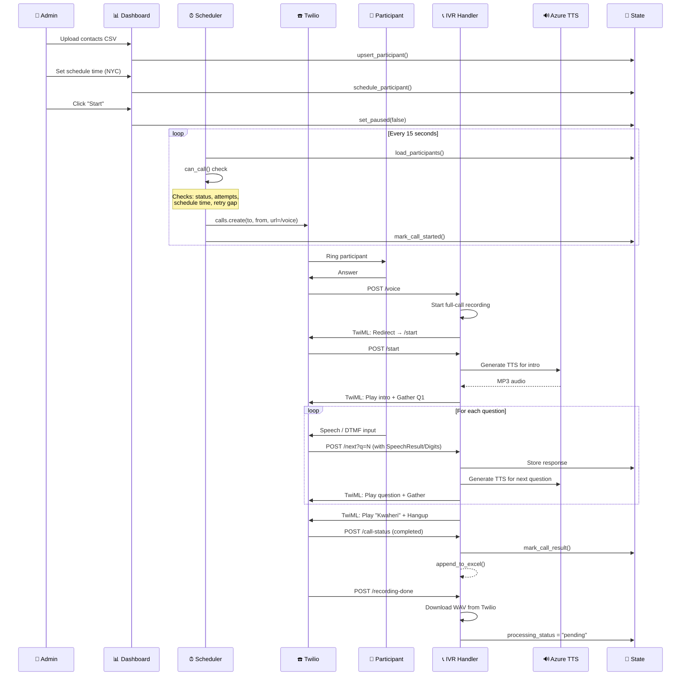
```mermaid
sequenceDiagram
    participant Admin as 👤 Admin
    participant Dash as 📊 Dashboard
    participant Sched as ⏰ Scheduler
    participant Twilio as ☎️ Twilio
    participant Phone as 📱 Participant
    participant IVR as 📞 IVR Handler
    participant Azure as 🔊 Azure TTS
    participant State as 📁 State

    Admin->>Dash: Upload contacts CSV
    Dash->>State: upsert_participant()

    Admin->>Dash: Set schedule time (NYC)
    Dash->>State: schedule_participant()

    Admin->>Dash: Click "Start"
    Dash->>State: set_paused(false)

    loop Every 15 seconds
        Sched->>State: load_participants()
        Sched->>Sched: can_call() check
        Note over Sched: Checks: status, attempts,<br/>schedule time, retry gap

        Sched->>Twilio: calls.create(to, from, url=/voice)
        Sched->>State: mark_call_started()
    end

    Twilio->>Phone: Ring participant
    Phone->>Twilio: Answer
    Twilio->>IVR: POST /voice
    IVR->>IVR: Start full-call recording
    IVR->>Twilio: TwiML: Redirect → /start

    Twilio->>IVR: POST /start
    IVR->>Azure: Generate TTS for intro
    Azure-->>IVR: MP3 audio
    IVR->>Twilio: TwiML: Play intro + Gather Q1

    loop For each question
        Phone->>Twilio: Speech / DTMF input
        Twilio->>IVR: POST /next?q=N (with SpeechResult/Digits)
        IVR->>State: Store response
        IVR->>Azure: Generate TTS for next question
        IVR->>Twilio: TwiML: Play question + Gather
    end

    IVR->>Twilio: TwiML: Play "Kwaheri" + Hangup
    Twilio->>IVR: POST /call-status (completed)
    IVR->>State: mark_call_result()
    IVR-->>IVR: append_to_excel()

    Twilio->>IVR: POST /recording-done
    IVR->>IVR: Download WAV from Twilio
    IVR->>State: processing_status = "pending"
```

### 4.2 ML Processing Pipeline


```mermaid
graph LR
    subgraph Input
        RAW["📼 Raw Recording<br/>(Stereo WAV)"]
    end

    subgraph Stage1["Stage 1: Audio Preprocessing"]
        FFMPEG1["FFmpeg<br/>Channel Extract<br/>+ Resample 48kHz"]
        DFN["DeepFilterNet<br/>Noise Removal<br/>(PyTorch)"]
        FFMPEG2["FFmpeg<br/>Resample 16kHz<br/>Mono PCM"]
    end

    subgraph Stage2["Stage 2: Transcription"]
        WHISPER["Whisper large-v3<br/>language='sw'<br/>temp=0.0"]
    end

    subgraph Stage3["Stage 3: Translation"]
        DETECT{"Language<br/>Detection"}
        SKIP["Copy as-is"]
        CHUNK["Chunk Splitter<br/>(3000 char)"]
        GTRANS["Google Translate<br/>sw → en<br/>(3 retries)"]
        JOIN["Join Chunks"]
    end

    subgraph Stage4["Stage 4: English TTS"]
        GTTS["gTTS<br/>lang='en'"]
    end

    subgraph Outputs
        CLEAN["🔊 Cleaned WAV"]
        TRANSCRIPT["📝 Transcript .txt"]
        TRANSLATION["📝 Translation .txt"]
        EN_MP3["🔊 English .mp3"]
    end

    RAW --> FFMPEG1 --> DFN --> FFMPEG2 --> CLEAN
    CLEAN --> WHISPER --> TRANSCRIPT
    TRANSCRIPT --> DETECT
    DETECT -->|"lang=en"| SKIP --> TRANSLATION
    DETECT -->|"lang≠en"| CHUNK --> GTRANS --> JOIN --> TRANSLATION
    TRANSLATION --> GTTS --> EN_MP3

    style Input fill:#7c5cff,stroke:#7c5cff,color:#fff
    style Stage1 fill:#1a1a2e,stroke:#f59f00,color:#e8ecff
    style Stage2 fill:#1a1a2e,stroke:#20c997,color:#e8ecff
    style Stage3 fill:#1a1a2e,stroke:#7c5cff,color:#e8ecff
    style Stage4 fill:#1a1a2e,stroke:#ff6b6b,color:#e8ecff
    style Outputs fill:#0b1020,stroke:#20c997,color:#e8ecff
```

### 4.3 Recording Callback Flow

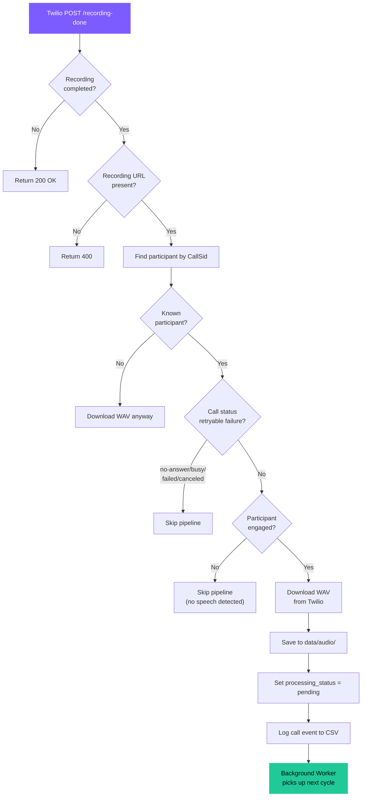
```mermaid
flowchart TD
    A["Twilio POST /recording-done"] --> B{"Recording<br/>completed?"}
    B -->|No| Z1["Return 200 OK"]
    B -->|Yes| C{"Recording URL<br/>present?"}
    C -->|No| Z2["Return 400"]
    C -->|Yes| D["Find participant by CallSid"]

    D --> E{"Known<br/>participant?"}
    E -->|No| F["Download WAV anyway"]
    E -->|Yes| G{"Call status<br/>retryable failure?"}

    G -->|"no-answer/busy/<br/>failed/canceled"| Z3["Skip pipeline"]
    G -->|No| H{"Participant<br/>engaged?"}

    H -->|No| Z4["Skip pipeline<br/>(no speech detected)"]
    H -->|Yes| I["Download WAV<br/>from Twilio"]

    I --> J["Save to data/audio/"]
    J --> K["Set processing_status = pending"]
    K --> L["Log call event to CSV"]
    L --> M["Background Worker<br/>picks up next cycle"]

    style A fill:#7c5cff,stroke:#7c5cff,color:#fff
    style M fill:#20c997,stroke:#20c997,color:#000
```

### 4.4 Excel Export Data Flow

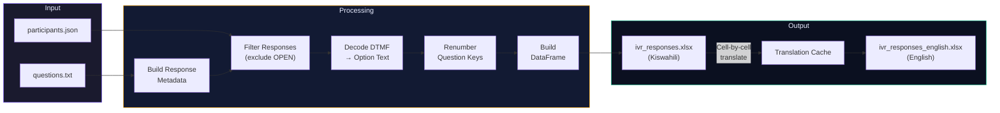
```mermaid
flowchart LR
    subgraph Input
        QF["questions.txt"]
        PS["participants.json"]
    end

    subgraph Processing
        META["Build Response<br/>Metadata"]
        FILTER["Filter Responses<br/>(exclude OPEN)"]
        DECODE["Decode DTMF<br/>→ Option Text"]
        REMAP["Renumber<br/>Question Keys"]
        DF["Build<br/>DataFrame"]
    end

    subgraph Output
        XLSX_SW["ivr_responses.xlsx<br/>(Kiswahili)"]
        CACHE["Translation Cache"]
        XLSX_EN["ivr_responses_english.xlsx<br/>(English)"]
    end

    QF --> META
    PS --> FILTER
    META --> FILTER --> DECODE --> REMAP --> DF
    DF --> XLSX_SW
    XLSX_SW -->|"Cell-by-cell<br/>translate"| CACHE --> XLSX_EN

    style Input fill:#1a1a2e,stroke:#7c5cff,color:#e8ecff
    style Processing fill:#121a33,stroke:#f59f00,color:#e8ecff
    style Output fill:#0b1020,stroke:#20c997,color:#e8ecff
```

---

## 5. API Reference

### 5.1 Public Endpoints (No Auth Required)

These endpoints are accessible without authentication — they are called by Twilio webhooks or used for health checks.

#### `POST /voice`
> **Twilio Inbound Call Entrypoint**

Initiates full-call recording and redirects to the survey start.

| Parameter | Source | Description |
|-----------|--------|-------------|
| `CallSid` | Twilio | Unique call identifier |
| `From` | Twilio | Caller phone number |

**Response:** TwiML — starts `<Recording>`, redirects to `/start`

---

#### `POST /start`
> **Survey Introduction**

Plays the first 2 intro prompts (INFO questions), then begins the first survey question.

| Parameter | Source | Description |
|-----------|--------|-------------|
| `CallSid` | Twilio | Call identifier |

**Response:** TwiML — plays intros, gathers first OPEN question

---

#### `POST /next?q={index}`
> **Survey Question Router**

Core question loop. Stores previous answer, advances to next question based on type.

| Parameter | Source | Description |
|-----------|--------|-------------|
| `q` | Query string | 0-based question index |
| `CallSid` | Twilio | Call identifier |
| `SpeechResult` | Twilio | Transcribed speech (OPEN questions) |

**Response:** TwiML — varies by question type (Gather speech / Gather DTMF / Play + Redirect)

---

#### `POST /mcq-handler?q={index}`
> **MCQ/MCQO DTMF Handler**

Processes keypad digit for multiple choice questions. If MCQO and "Other" selected, redirects to speech capture.

| Parameter | Source | Description |
|-----------|--------|-------------|
| `q` | Query string | Question index |
| `Digits` | Twilio | Pressed DTMF digit (1-9) |
| `CallSid` | Twilio | Call identifier |

**Response:** TwiML — either redirects to next question or to `/mcqo-other-handler`

---

#### `POST /mcqo-other-handler?q={index}`
> **MCQO "Other" Speech Handler**

Captures (but does not store) the free-speech "Other" response and moves to the next question.

| Parameter | Source | Description |
|-----------|--------|-------------|
| `q` | Query string | Question index |
| `SpeechResult` | Twilio | Free-speech "Other" response |

**Response:** TwiML — redirects to `/next?q={q+1}`

---

#### `POST /call-status`
> **Twilio Call Status Webhook**

Receives call completion events. Updates participant state and triggers Excel export on completion.

| Parameter | Source | Description |
|-----------|--------|-------------|
| `CallSid` | Twilio | Call identifier |
| `CallStatus` | Twilio | One of: `completed`, `no-answer`, `busy`, `failed`, `canceled` |

**Response:** `200 OK`

---

#### `POST /recording-done`
> **Twilio Recording Completion Webhook**

Downloads the completed recording WAV and queues it for ML processing.

| Parameter | Source | Description |
|-----------|--------|-------------|
| `CallSid` | Twilio | Call identifier |
| `RecordingUrl` | Twilio | URL to download recording |
| `RecordingStatus` | Twilio | `completed` or other |

**Response:** `200 OK`

---

#### `GET /health`
> **Health Check**

Simple liveness probe.

**Response:** `200 OK` — body: `ok`

---

#### `POST /conference_host`, `POST /conference_join`, `POST /conference_ivr`, `POST /conference_ivr_next`
> **Conference Call Endpoints**

Handle the Twilio conference call flow. The host enters a waiting room where IVR questions play, then the conference starts when all questions are complete.

---

#### `POST /silence`
> **Silence Generator**

Returns TwiML with a 60-second pause. Used as conference hold music fallback.

---

#### `GET /ivr-audio/<filename>`
> **Static IVR Audio Server**

Serves pre-generated Azure TTS audio files from `data/ivr_audio/`.

---

### 5.2 Authenticated Endpoints (Login Required)

All `/admin/*` routes require an active session (cookie-based) or a valid `ADMIN_TOKEN` query parameter.

#### `GET /admin`
> **Admin Dashboard**

Renders the full admin dashboard HTML page.

**Response:** `200 OK` — HTML page

---

#### `GET /admin/live_state`
> **Live State JSON API**

Returns current participant state for live-polling dashboard updates.

**Response:**
```json
{
  "total": 42,
  "counts": {
    "pending": 10,
    "in_progress": 5,
    "completed": 25,
    "failed": 2
  },
  "participants": [
    {
      "participant_id": "P001",
      "phone_masked": "+2******1234",
      "status": "completed",
      "attempts": 1,
      "engaged": true,
      "scheduled_local": "2026-03-15 14:00",
      "scheduled_input": "2026-03-15 14:00"
    }
  ]
}
```

---

#### `POST /admin/upload_contacts`
> **Upload Participant CSV**

Accepts a CSV file with headers `participant_id,phone_e164`. Creates participant entries with `idle` status (not immediately callable).

---

#### `POST /admin/save_questions`
> **Save Survey Questions**

Saves the survey question text to `data/questions.txt`.

---

#### `POST /admin/schedule`
> **Schedule Participant Call**

Sets a participant's scheduled call time (NYC timezone).

| Parameter | Source | Description |
|-----------|--------|-------------|
| `participant_id` | Form | Participant ID |
| `local_time` | Form | `YYYY-MM-DD HH:MM` (NYC time) |

---

#### `POST /admin/dial_now`
> **Force Dial**

Triggers `run_once(force=True)` — calls all eligible participants immediately, bypassing schedule/retry timing.

---

#### `POST /admin/pause` / `POST /admin/resume`
> **System Pause / Resume**

Toggles the global scheduler pause state.

---

#### `POST /admin/reset_state`
> **Reset State**

Creates timestamped backups of `participants.json` and `call_log.csv`, then resets all state.

---

#### `GET /admin/export_excel`
> **Export Survey Responses (Original Language)**

Downloads `ivr_responses.xlsx` containing MCQ/MCQO responses with option text decoded.

---

#### `GET /admin/export_excel_english`
> **Export Survey Responses (English)**

Translates all response cells to English and downloads `ivr_responses_english.xlsx`.

---

#### `POST /admin/conference_call`
> **Start Conference Call**

Dials two phone numbers into a shared Twilio conference room.

| Parameter | Source | Description |
|-----------|--------|-------------|
| `number_1` | Form | First phone number (E.164) |
| `number_2` | Form | Second phone number (E.164) |

---

### 5.3 Authentication Endpoints

#### `GET /login`
> **Login Page**

Renders the login form.

---

#### `POST /login`
> **Login Submit**

Authenticates the user against `config.yaml` password hashes.

| Parameter | Source | Description |
|-----------|--------|-------------|
| `username` | Form | Username (case-insensitive) |
| `password` | Form | Plaintext password |

**Responses:**
- Success → redirect to `/admin`
- Invalid credentials → re-render login page with error
- Locked out → show remaining lockout time

---

#### `POST /logout`
> **Logout**

Clears the session and logs the event.

---

## 6. Data Models & State Schema

### 6.1 Participant Schema

Each participant in `data/state/participants.json` follows this schema:

```json
{
  "P001": {
    "status": "pending",
    "attempts": 0,
    "last_call_time": null,
    "last_call_sid": null,
    "last_call_status": null,
    "engaged": false,
    "last_recording_url": null,
    "last_outputs": {},
    "scheduled_time_local": null,
    "scheduled_time_utc": null,
    "phone_e164": "+254700000000",
    "responses": {
      "q1": "2",
      "q2": "1",
      "q3": "3"
    },
    "survey_q_counter": 3,
    "processing_status": "completed",
    "audio_path": "data/audio/P001_20260315_140000.wav",
    "recording_url": "https://api.twilio.com/2010-04-01/Accounts/.../Recordings/RE..."
  }
}
```

### 6.2 Participant State Machine

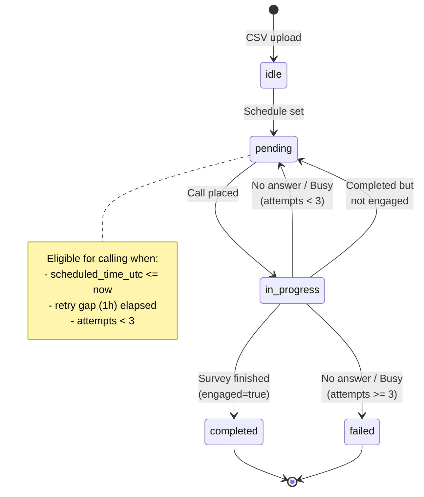
```mermaid
stateDiagram-v2
    [*] --> idle : CSV upload
    idle --> pending : Schedule set
    pending --> in_progress : Call placed
    in_progress --> completed : Survey finished<br/>(engaged=true)
    in_progress --> pending : No answer / Busy<br/>(attempts < 3)
    in_progress --> failed : No answer / Busy<br/>(attempts >= 3)
    in_progress --> pending : Completed but<br/>not engaged

    completed --> [*]
    failed --> [*]

    note right of pending
        Eligible for calling when:
        - scheduled_time_utc <= now
        - retry gap (1h) elapsed
        - attempts < 3
    end note
```

### 6.3 Processing Status State Machine

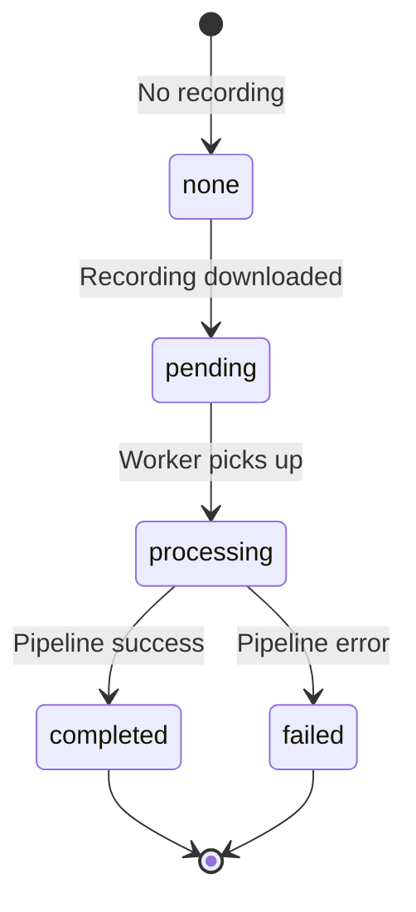
```mermaid
stateDiagram-v2
    [*] --> none : No recording
    none --> pending : Recording downloaded
    pending --> processing : Worker picks up
    processing --> completed : Pipeline success
    processing --> failed : Pipeline error

    completed --> [*]
    failed --> [*]
```

### 6.4 Call Log Schema

`data/state/call_log.csv` columns:

| Column | Type | Description |
|--------|------|-------------|
| `timestamp_utc` | ISO 8601 | Event timestamp |
| `participant_id` | String | Participant identifier |
| `phone_masked` | String | Masked phone (e.g., `+2******1234`) |
| `direction` | String | `inbound` or `outbound-api` |
| `call_sid` | String | Twilio call SID |
| `recording_url` | URL | Twilio recording URL |
| `audio_path` | String | Local file path |
| `transcript_path` | String | Local transcript path |
| `translation_path` | String | Local translation path |
| `english_audio_path` | String | Local English audio path |

### 6.5 Auth State Schema

`data/auth_state.json`:
```json
{
  "fails": {
    "username|ip_address": [1711234567, 1711234580]
  },
  "locks": {
    "username|ip_address": 1711235467
  }
}
```

### 6.6 Settings Schema

`data/state/settings.json`:
```json
{
  "paused": false
}
```

---

## 7. Authentication & Security

### 7.1 Authentication Flow

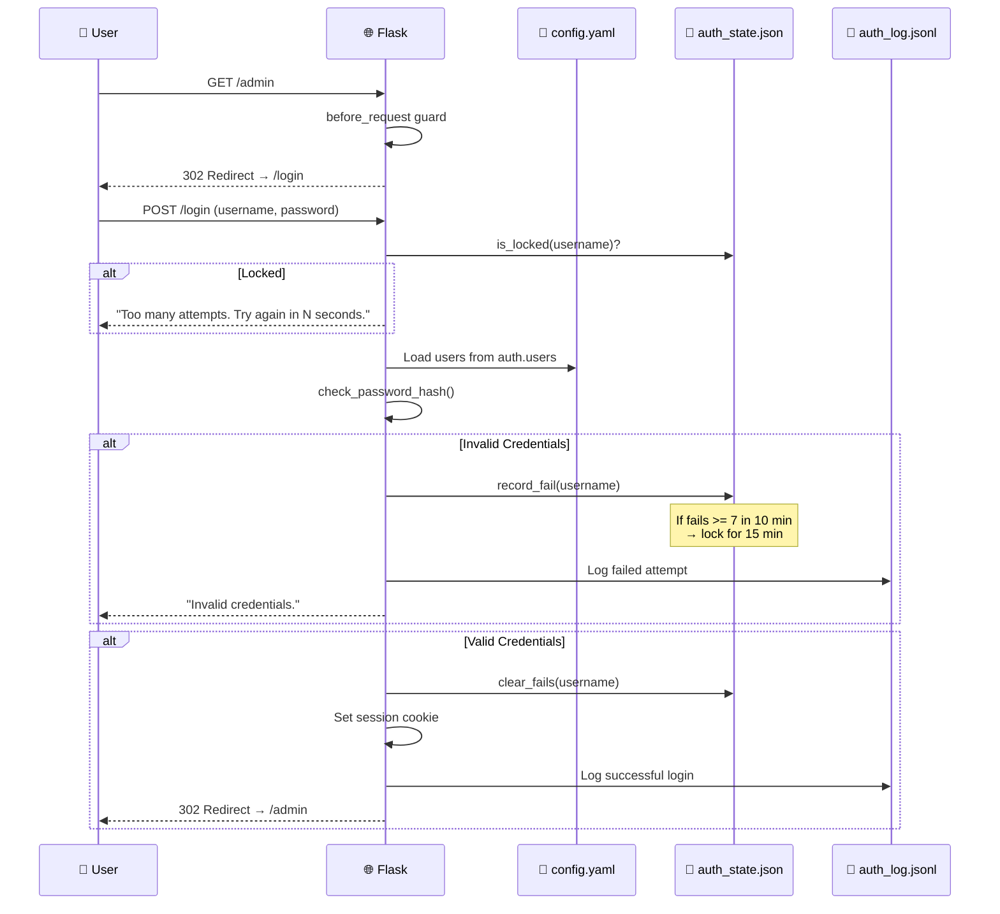
```mermaid
sequenceDiagram
    participant User as 👤 User
    participant Flask as 🌐 Flask
    participant Config as 📄 config.yaml
    participant AuthState as 📁 auth_state.json
    participant AuthLog as 📁 auth_log.jsonl

    User->>Flask: GET /admin
    Flask->>Flask: before_request guard
    Flask-->>User: 302 Redirect → /login

    User->>Flask: POST /login (username, password)

    Flask->>AuthState: is_locked(username)?
    alt Locked
        Flask-->>User: "Too many attempts. Try again in N seconds."
    end

    Flask->>Config: Load users from auth.users
    Flask->>Flask: check_password_hash()

    alt Invalid Credentials
        Flask->>AuthState: record_fail(username)
        Note over AuthState: If fails >= 7 in 10 min<br/>→ lock for 15 min
        Flask->>AuthLog: Log failed attempt
        Flask-->>User: "Invalid credentials."
    end

    alt Valid Credentials
        Flask->>AuthState: clear_fails(username)
        Flask->>Flask: Set session cookie
        Flask->>AuthLog: Log successful login
        Flask-->>User: 302 Redirect → /admin
    end
```

### 7.2 Security Measures

| Measure | Implementation | Details |
|---------|---------------|---------|
| **Password Hashing** | PBKDF2-SHA256 | 1,000,000 iterations via Werkzeug |
| **Brute-Force Protection** | Rate limiting | 7 failures in 10 minutes → 15-minute lockout per username+IP |
| **Session Security** | Flask sessions | `HttpOnly`, `SameSite=Lax`, `Secure=True`, 8-hour lifetime |
| **Phone Masking** | `mask_phone()` | Only first 2 + last 4 digits shown (e.g., `+2******1234`) |
| **PII Protection** | `.gitignore` | Contacts CSV, participant state, audio, and logs are git-ignored |
| **Route Protection** | `@app.before_request` | All `/admin` routes require session or admin token |
| **Webhook Passthrough** | Allowlist | Twilio webhook paths (`/voice`, `/next`, etc.) bypass auth |
| **Audit Logging** | JSONL | Every login/logout event logged with IP, user-agent, timestamps |

### 7.3 Request Guard Logic

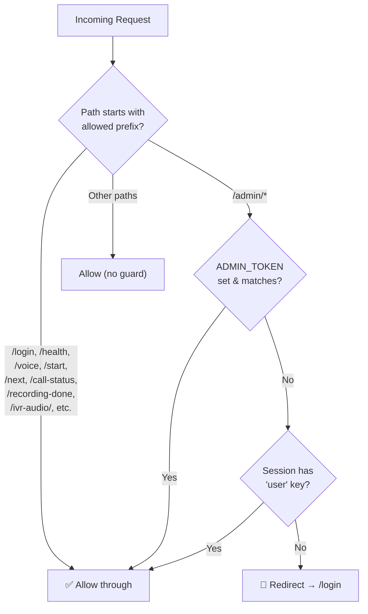
```mermaid
flowchart TD
    REQ["Incoming Request"] --> CHECK{"Path starts with<br/>allowed prefix?"}

    CHECK -->|"/login, /health,<br/>/voice, /start,<br/>/next, /call-status,<br/>/recording-done,<br/>/ivr-audio/, etc."| ALLOW["✅ Allow through"]

    CHECK -->|"/admin/*"| TOKEN{"ADMIN_TOKEN<br/>set & matches?"}
    TOKEN -->|Yes| ALLOW
    TOKEN -->|No| SESSION{"Session has<br/>'user' key?"}
    SESSION -->|Yes| ALLOW
    SESSION -->|No| REDIRECT["🔄 Redirect → /login"]

    CHECK -->|"Other paths"| PASS["Allow (no guard)"]
```

---

## 8. Survey Question Engine

### 8.1 Question File Format

Questions are stored in `data/questions.txt` using a pipe-delimited format:

```
TYPE|Question Text|Option1|Option2|...
```

### 8.2 Supported Question Types

| Type | Format | Input Method | Response Storage | Example |
|------|--------|-------------|-----------------|---------|
| **INFO** | `INFO\|text` | None (read-only) | Not stored | `INFO\|Maswali sehemu ya kwanza` |
| **OPEN** | `OPEN\|text` | Speech (`<Gather input="speech">`) | Raw speech text | `OPEN\|Tafadhali sema jina lako` |
| **MCQ** | `MCQ\|text\|opt1\|opt2\|opt3` | DTMF keypad (`<Gather input="dtmf">`) | Digit (1-9) | `MCQ\|Nani..?\|Marafiki\|Mume\|Watoto` |
| **MCQO** | `MCQO\|text\|opt1\|opt2\|Nyingine` | DTMF + optional speech | Digit (1-9) | `MCQO\|Kupanga..?\|Ndiyo\|Hapana\|Nyingine` |

### 8.3 IVR Question Flow

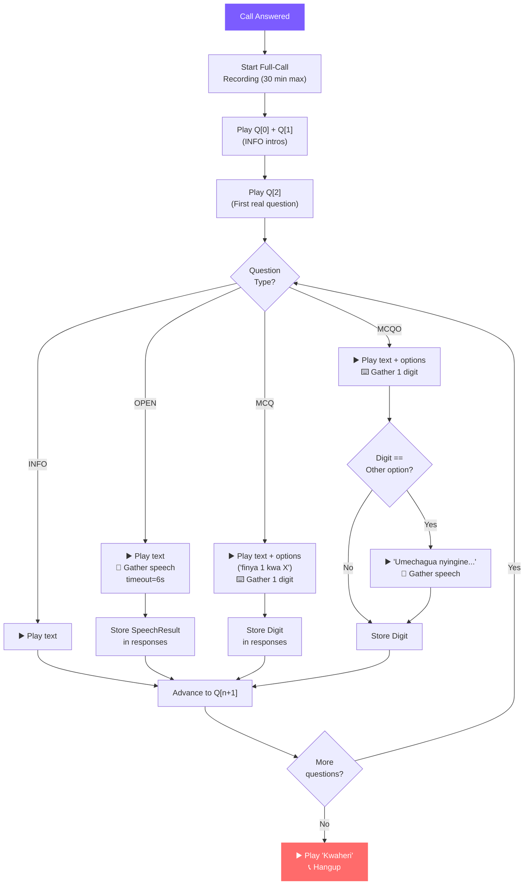
```mermaid
flowchart TD
    START["Call Answered"] --> RECORD["Start Full-Call<br/>Recording (30 min max)"]
    RECORD --> INTRO["Play Q[0] + Q[1]<br/>(INFO intros)"]
    INTRO --> Q2["Play Q[2]<br/>(First real question)"]

    Q2 --> LOOP{"Question<br/>Type?"}

    LOOP -->|INFO| PLAY_INFO["▶️ Play text"]
    PLAY_INFO --> NEXT_Q["Advance to Q[n+1]"]

    LOOP -->|OPEN| GATHER_SPEECH["▶️ Play text<br/>🎤 Gather speech<br/>timeout=6s"]
    GATHER_SPEECH --> STORE_SPEECH["Store SpeechResult<br/>in responses"]
    STORE_SPEECH --> NEXT_Q

    LOOP -->|MCQ| GATHER_DTMF["▶️ Play text + options<br/>('finya 1 kwa X')<br/>⌨️ Gather 1 digit"]
    GATHER_DTMF --> STORE_DIGIT["Store Digit<br/>in responses"]
    STORE_DIGIT --> NEXT_Q

    LOOP -->|MCQO| GATHER_DTMF2["▶️ Play text + options<br/>⌨️ Gather 1 digit"]
    GATHER_DTMF2 --> CHECK_OTHER{"Digit ==<br/>Other option?"}
    CHECK_OTHER -->|No| STORE_DIGIT2["Store Digit"]
    CHECK_OTHER -->|Yes| OTHER_PROMPT["▶️ 'Umechagua nyingine...'<br/>🎤 Gather speech"]
    OTHER_PROMPT --> STORE_DIGIT2
    STORE_DIGIT2 --> NEXT_Q

    NEXT_Q --> END_CHECK{"More<br/>questions?"}
    END_CHECK -->|Yes| LOOP
    END_CHECK -->|No| BYE["▶️ Play 'Kwaheri'<br/>📞 Hangup"]

    style START fill:#7c5cff,stroke:#7c5cff,color:#fff
    style BYE fill:#ff6b6b,stroke:#ff6b6b,color:#fff
```

### 8.4 TTS Prompt Generation

Survey prompts are spoken aloud using **Azure Cognitive Services Neural TTS**:

- **Voice:** `sw-KE-ZuriNeural` (Swahili) / `en-US-JennyNeural` (English)
- **Rate:** `-15%` prosody for clearer, slower speech
- **Caching:** SHA1 hash of `voice|format|text` → disk-cached MP3 in `data/ivr_audio/`
- **Serving:** Public URL via `/ivr-audio/{hash}.mp3`, referenced in TwiML `<Play>` tags
- **Format:** SSML with XML entity escaping

### 8.5 MCQ Option Verbalization

For MCQ/MCQO questions, options are read aloud with their digit mapping:

```
"finya 1 kwa Ndiyo. finya 2 kwa Hapana. finya 3 kwa Nyingine."
```
(Translation: "press 1 for Yes. press 2 for No. press 3 for Other.")

---

## 9. Configuration Reference

### 9.1 Environment Variables (`.env`)

| Variable | Required | Default | Description |
|----------|----------|---------|-------------|
| `TWILIO_ACCOUNT_SID` | Yes | — | Twilio account SID |
| `TWILIO_AUTH_TOKEN` | Yes | — | Twilio auth token |
| `TWILIO_FROM_NUMBER` | Yes | — | Twilio phone number (E.164) |
| `PUBLIC_BASE_URL` | Yes | — | Public URL for webhooks (ngrok or custom) |
| `ADMIN_TOKEN` | No | `""` | Optional token for admin access without login |
| `AZURE_SPEECH_KEY` | Yes | — | Azure Cognitive Services subscription key |
| `AZURE_SPEECH_REGION` | Yes | — | Azure region (e.g., `eastus`) |
| `AZURE_TTS_VOICE_SW` | No | `sw-KE-ZuriNeural` | Swahili TTS voice name |
| `AZURE_TTS_VOICE_EN` | No | `en-US-JennyNeural` | English TTS voice name |
| `AZURE_TTS_FORMAT` | No | `audio-16khz-128kbitrate-mono-mp3` | Audio output format |
| `MAX_CALLS_PER_TICK` | No | `3` | Max concurrent calls per scheduler tick |
| `CALL_SPACING_SEC` | No | `0.8` | Delay between outbound calls |
| `FLASK_SECRET_KEY` | No | `CHANGE_ME_NOW` | Flask session signing key |
| `AUTO_START_NGROK` | No | `1` | Auto-start ngrok tunnel |
| `APP_OPEN_URL` | No | — | Custom URL to open in browser |
| `OPEN_PUBLIC_URL` | No | `0` | Open ngrok URL instead of localhost |
| `AUTH_STATE_PATH` | No | `data/auth_state.json` | Auth state file location |
| `AUTH_LOG_PATH` | No | `data/auth_log.jsonl` | Auth event log location |
| `AUTH_MAX_FAILS` | No | `7` | Failed attempts before lockout |
| `AUTH_LOCK_SECONDS` | No | `900` | Lockout duration (seconds) |
| `AUTH_WINDOW_SECONDS` | No | `600` | Failure tracking window (seconds) |

### 9.2 Configuration File (`config.yaml`)

```yaml
# ──────────────────────────────────────────────
# Twilio Configuration
# ──────────────────────────────────────────────
twilio:
  account_sid: ""              # (Overridden by .env)
  auth_token: ""               # (Overridden by .env)
  from_number: ""              # (Overridden by .env)
  public_base_url: ""          # (Overridden by .env)

# ──────────────────────────────────────────────
# IVR Configuration
# ──────────────────────────────────────────────
ivr:
  questions_file: "data/questions.txt"    # Path to questions file
  gather_timeout_sec: 6                   # Seconds to wait for input
  speech_timeout: "auto"                  # Twilio auto speech detection
  say_voice: "alice"                      # Fallback Twilio voice
  speech_language: "sw-KE"                # Kiswahili-Kenya for recognition

# ──────────────────────────────────────────────
# Audio Preprocessing (DeepFilterNet)
# ──────────────────────────────────────────────
audio_processing:
  enabled: true                           # Toggle noise removal
  backend: "deepfilternet"                # Only supported backend
  processed_dir: "data/audio_processed"   # Cleaned audio output
  temp_dir: "data/audio_processed/tmp"    # Intermediate files
  output_sample_rate: 16000               # Whisper expects 16kHz
  model_sample_rate: 48000                # DeepFilterNet expects 48kHz
  channel_mode: "mixdown"                 # "mixdown" or "channel"
  caller_channel: 0                       # Channel index if mode="channel"
  keep_intermediate_files: false          # Cleanup temp files

# ──────────────────────────────────────────────
# Authentication
# ──────────────────────────────────────────────
auth:
  users:
    username:
      password_hash: "pbkdf2:sha256:..."  # Werkzeug generate_password_hash()
```

### 9.3 State Management Constants

| Constant | Value | Location | Description |
|----------|-------|----------|-------------|
| `MAX_ATTEMPTS` | `3` | `state.py` | Maximum call attempts per participant |
| `RETRY_GAP` | `1 hour` | `state.py` | Minimum time between retry attempts |
| `RECORDING_MAX_SEC` | `1800` (30 min) | `twilio_handler.py` | Maximum recording duration |
| `GATHER_TIMEOUT` | `6` seconds | `config.yaml` | DTMF/speech input timeout |
| `SCHEDULER_INTERVAL` | `15` seconds | `twilio_handler.py` | Scheduler polling interval |
| `WORKER_POLL` | `5` seconds | `background_worker.py` | Worker polling interval |
| `MAX_CHARS` | `3000` | `translate.py` | Max characters per translation chunk |

---

## 10. Admin Dashboard

### 10.1 UI Layout

```
┌─────────────────────────────────────────────────────────────────────┐
│ AudioSurvey AI — Admin                           System: [RUNNING] │
│ NYC time: 2026-03-20 14:32:15 EDT    Logged in as: krishnanand     │
│                                                        [Sign out]  │
├─────────────────────────────────────────────────────────────────────┤
│ [Dial Now] [Start] [Stop] [State Refresh] [Export Excel] [English] │
│                                                                     │
│ ┌──────────┐ ┌──────────┐ ┌──────────┐ ┌──────────┐               │
│ │    42    │ │    10    │ │     5    │ │    25    │               │
│ │  Total   │ │ Pending  │ │In Progress│ │Completed │               │
│ └──────────┘ └──────────┘ └──────────┘ └──────────┘               │
├─────────────────────────────────────────────────────────────────────┤
│ ┌─────────────────────┐  ┌─────────────────────────────┐          │
│ │  Upload Contacts    │  │  Questions                  │          │
│ │  [Choose CSV] [Upload]│  │  ┌─────────────────────┐   │          │
│ │                     │  │  │ INFO|Maswali kuhu...│   │          │
│ │                     │  │  │ OPEN|Tafadhali se...│   │          │
│ │                     │  │  │ MCQ|Mado anataka...│    │          │
│ │                     │  │  └─────────────────────┘   │          │
│ │                     │  │  [Save questions]           │          │
│ └─────────────────────┘  └─────────────────────────────┘          │
├─────────────────────────────────────────────────────────────────────┤
│ Conference Call                                                     │
│ [+1...] [+1...] [Start call]                                       │
├─────────────────────────────────────────────────────────────────────┤
│ Participants                                                        │
│ ┌────────┬──────────┬──────────┬────┬──────────┬────────┬────────┐ │
│ │ ID     │ Phone    │ Status   │Att.│ Engaged  │Sched.  │Schedule│ │
│ ├────────┼──────────┼──────────┼────┼──────────┼────────┼────────┤ │
│ │ P001   │ +2****34 │●Completed│ 1  │🟢Engaged │03-15   │[___][Set]│
│ │ P002   │ +2****56 │●Pending  │ 0  │⚪Not eng.│        │[___][Set]│
│ │ P003   │ +2****78 │●Failed   │ 3  │⚪Not eng.│03-14   │[___][Set]│
│ └────────┴──────────┴──────────┴────┴──────────┴────────┴────────┘ │
└─────────────────────────────────────────────────────────────────────┘
```

### 10.2 Live Polling Architecture

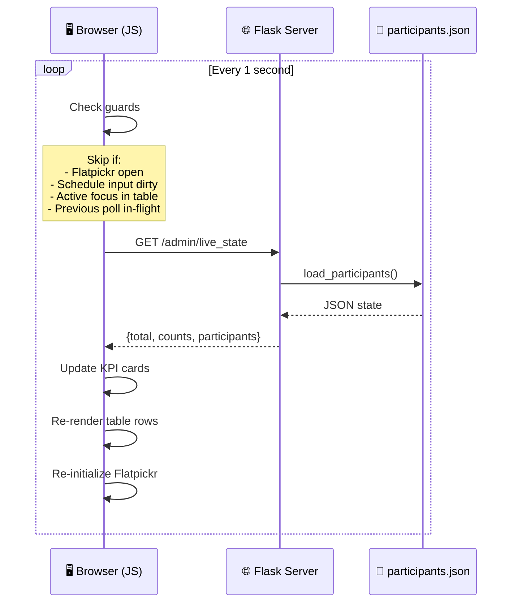
```mermaid
sequenceDiagram
    participant Browser as 🖥️ Browser (JS)
    participant Flask as 🌐 Flask Server
    participant State as 📁 participants.json

    loop Every 1 second
        Browser->>Browser: Check guards
        Note over Browser: Skip if:<br/>- Flatpickr open<br/>- Schedule input dirty<br/>- Active focus in table<br/>- Previous poll in-flight

        Browser->>Flask: GET /admin/live_state
        Flask->>State: load_participants()
        State-->>Flask: JSON state
        Flask-->>Browser: {total, counts, participants}

        Browser->>Browser: Update KPI cards
        Browser->>Browser: Re-render table rows
        Browser->>Browser: Re-initialize Flatpickr
    end
```

### 10.3 Dashboard Features

| Feature | Description |
|---------|-------------|
| **Live NYC Clock** | JavaScript Intl.DateTimeFormat, updates every second |
| **KPI Cards** | Total, Pending, In Progress, Completed — live-updated |
| **Status Pills** | Color-coded badges: green=completed, yellow=in_progress, red=failed, gray=pending |
| **Engaged Badges** | Green dot = engaged, gray dot = not engaged |
| **Flatpickr Date Picker** | Dark-themed calendar with time selection and confirm plugin |
| **Dirty Input Detection** | Prevents live-poll from overwriting user's in-progress schedule edits |
| **File Upload** | Styled file input with chosen filename display |
| **Dark Theme** | Custom CSS with glassmorphism, radial gradients, and blur effects |

---

## 11. Background Services

### 11.1 Service Lifecycle

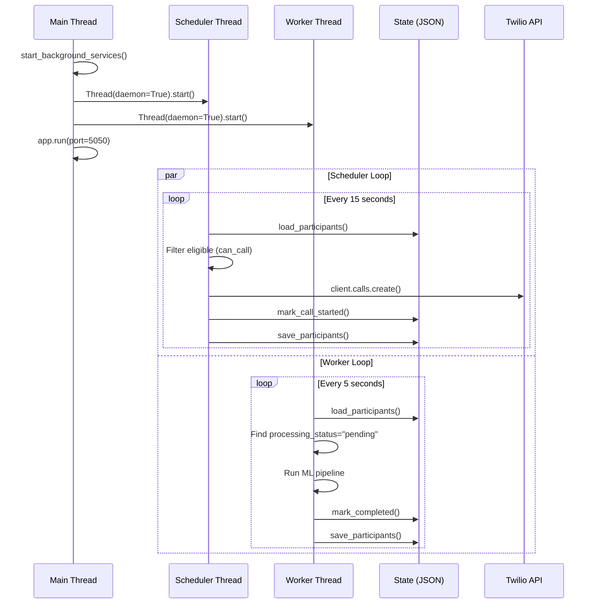
```mermaid
sequenceDiagram
    participant Main as Main Thread
    participant Sched as Scheduler Thread
    participant Worker as Worker Thread
    participant State as State (JSON)
    participant Twilio as Twilio API

    Main->>Main: start_background_services()
    Main->>Sched: Thread(daemon=True).start()
    Main->>Worker: Thread(daemon=True).start()
    Main->>Main: app.run(port=5050)

    par Scheduler Loop
        loop Every 15 seconds
            Sched->>State: load_participants()
            Sched->>Sched: Filter eligible (can_call)
            Sched->>Twilio: client.calls.create()
            Sched->>State: mark_call_started()
            Sched->>State: save_participants()
        end
    and Worker Loop
        loop Every 5 seconds
            Worker->>State: load_participants()
            Worker->>Worker: Find processing_status="pending"
            Worker->>Worker: Run ML pipeline
            Worker->>State: mark_completed()
            Worker->>State: save_participants()
        end
    end
```

### 11.2 Call Eligibility Logic (`can_call`)

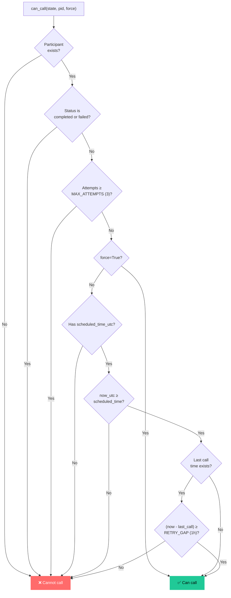
```mermaid
flowchart TD
    A["can_call(state, pid, force)"] --> B{"Participant<br/>exists?"}
    B -->|No| DENY["❌ Cannot call"]
    B -->|Yes| C{"Status is<br/>completed or failed?"}
    C -->|Yes| DENY
    C -->|No| D{"Attempts ≥<br/>MAX_ATTEMPTS (3)?"}
    D -->|Yes| DENY
    D -->|No| E{"force=True?"}
    E -->|Yes| ALLOW["✅ Can call"]
    E -->|No| F{"Has scheduled_time_utc?"}
    F -->|No| DENY
    F -->|Yes| G{"now_utc ≥<br/>scheduled_time?"}
    G -->|No| DENY
    G -->|Yes| H{"Last call<br/>time exists?"}
    H -->|No| ALLOW
    H -->|Yes| I{"(now - last_call) ≥<br/>RETRY_GAP (1h)?"}
    I -->|No| DENY
    I -->|Yes| ALLOW

    style ALLOW fill:#20c997,stroke:#20c997,color:#000
    style DENY fill:#ff6b6b,stroke:#ff6b6b,color:#fff
```

### 11.3 Worker Pipeline Stages

| Stage | Progress | Duration | Description |
|-------|----------|----------|-------------|
| 1. Prepare | 10-25% | ~5s | FFmpeg: extract channel, resample to 48kHz mono |
| 2. Denoise | 25-60% | ~30-60s | DeepFilterNet: neural noise removal (GPU if available) |
| 3. Resample | 60-75% | ~3s | FFmpeg: downsample to 16kHz for Whisper |
| 4. Transcribe | 75-85% | ~60-120s | Whisper large-v3: Swahili STT |
| 5. Translate | 85-93% | ~5-15s | Google Translate: chunked sw→en |
| 6. English TTS | 93-97% | ~5-10s | gTTS: English audio synthesis |
| 7. Complete | 100% | — | Mark completed, save state |

---

## 12. Error Handling & Resilience

### 12.1 Fault Tolerance Matrix

| Component | Failure Mode | Handling Strategy |
|-----------|-------------|-------------------|
| **Twilio Call** | No answer / Busy | Mark `pending`, retry after 1h (up to 3 attempts) |
| **Twilio Call** | Failed / Canceled | Mark `failed` if max attempts reached |
| **Azure TTS** | API error | RuntimeError raised, prevents corrupted audio serving |
| **Azure TTS** | Duplicate request | Disk cache by content hash prevents re-synthesis |
| **Whisper** | Transcription drift | `condition_on_previous_text=False`, `temperature=0.0` |
| **Google Translate** | API error | 3 retries with 1.5s backoff; failed chunks marked with `[TRANSLATION_FAILED_CHUNK]` |
| **Google Translate** | Returns `None` | Explicit None check with RuntimeError |
| **DeepFilterNet** | Processing error | Graceful fallback to unprocessed audio |
| **Recording Download** | HTTP error | Logged, returns 200 (Twilio won't retry) |
| **State File** | Corrupt JSON | Renamed to `.corrupt`, returns empty state |
| **State File** | Concurrent access | `threading.RLock()` + atomic write (`.tmp` → `os.replace`) |
| **Scheduler** | Exception in tick | Caught and logged, loop continues |
| **Worker** | Exception in pipeline | Caught, `processing_status` set to `failed`, loop continues |
| **Auth State** | Missing file | Returns safe defaults `{"fails": {}, "locks": {}}` |
| **Config** | Missing `config.yaml` | Uses hardcoded defaults |

### 12.2 Retry Policy

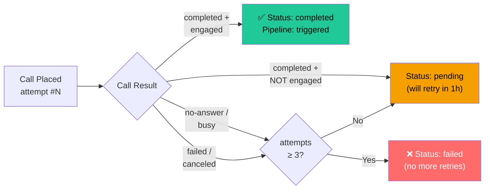
```mermaid
graph LR
    CALL["Call Placed<br/>attempt #N"] --> RESULT{"Call Result"}

    RESULT -->|"completed +<br/>engaged"| DONE["✅ Status: completed<br/>Pipeline: triggered"]
    RESULT -->|"completed +<br/>NOT engaged"| RETRY_PEND["Status: pending<br/>(will retry in 1h)"]
    RESULT -->|"no-answer /<br/>busy"| ATT_CHECK{"attempts<br/>≥ 3?"}
    RESULT -->|"failed /<br/>canceled"| ATT_CHECK

    ATT_CHECK -->|Yes| FAIL["❌ Status: failed<br/>(no more retries)"]
    ATT_CHECK -->|No| RETRY_PEND

    style DONE fill:#20c997,color:#000
    style FAIL fill:#ff6b6b,color:#fff
    style RETRY_PEND fill:#f59f00,color:#000
```

---

## 13. Logging & Observability

### 13.1 Logging Architecture

| Log Type | Format | Location | Purpose |
|----------|--------|----------|---------|
| **Application Log** | Colored console | `stdout` | Real-time operational visibility |
| **Auth Event Log** | JSONL | `data/auth_log.jsonl` | Security audit trail |
| **Call Log** | CSV | `data/state/call_log.csv` | Call history and recording tracking |
| **Worker Progress** | Terminal progress bar | `stdout` | ML pipeline progress monitoring |

### 13.2 Console Log Format

```
[NYC 2026-03-20T14:32:15-04:00 | UTC 2026-03-20T18:32:15Z] PROMPT SENT | CallSid=CA123 | Participant=P001 | q3_mcq | Text="Mado anataka..."
```

### 13.3 Auth Event Log Format

```jsonl
{"event":"login","user":"krishnanand","ip":"127.0.0.1","login_utc":"2026-03-20T18:32:15Z","login_local":"2026-03-20 14:32:15 EDT","user_agent":"Mozilla/5.0..."}
{"event":"logout","user":"krishnanand","ip":"127.0.0.1","logout_utc":"2026-03-20T22:15:00Z","logout_local":"2026-03-20 18:15:00 EDT","session_duration_sec":13365}
```

### 13.4 Worker Progress Bar

```
[BackgroundWorker] participant=P001 | [################----]  80% | Removing background noise
```

### 13.5 Silenced Libraries

The following library loggers are suppressed to reduce noise:

`httpx`, `httpcore`, `httpcore.connection`, `httpcore.http2`, `hpack`, `hpack.hpack`, `h2`, `h2.connection`, `h2.config`, `gtts`, `gtts.tts`, `googletrans`, `urllib3`, `torio`, `torio._extension`, `torio._extension.utils`, `torchaudio`

---

## 14. Deployment Guide

### 14.1 Prerequisites

| Requirement | Version | Purpose |
|-------------|---------|---------|
| Python | 3.10+ | Runtime |
| pip | — | Package management |
| ngrok | 3.x | HTTPS tunneling |
| FFmpeg | 4.x+ | Audio processing |
| Twilio Account | — | Voice API |
| Azure Account | — | Cognitive Services TTS |

### 14.2 Local Development Setup

```bash
# 1. Clone the repository
git clone https://github.com/krishnanand20/audiosurvey_ai.git
cd audiosurvey_ai

# 2. Create virtual environment
python3 -m venv venv
source venv/bin/activate

# 3. Install dependencies
pip install -r requirements.txt

# 4. Configure environment
cp .env.example .env
# Edit .env with your Twilio + Azure credentials

# 5. Launch (auto-starts ngrok + Flask + opens browser)
python3 run_app.py
```

### 14.3 Startup Sequence

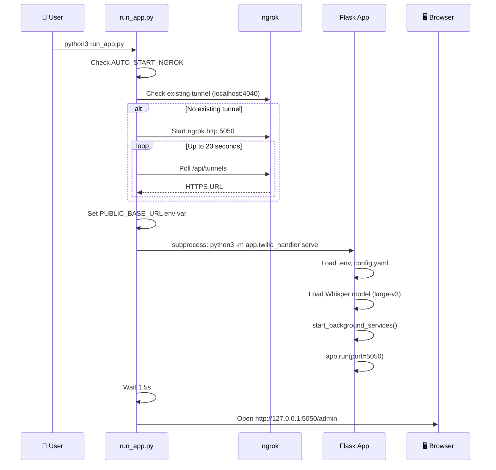
```mermaid
sequenceDiagram
    participant User as 👤 User
    participant RunApp as run_app.py
    participant Ngrok as ngrok
    participant Flask as Flask App
    participant Browser as 🖥️ Browser

    User->>RunApp: python3 run_app.py

    RunApp->>RunApp: Check AUTO_START_NGROK
    RunApp->>Ngrok: Check existing tunnel (localhost:4040)

    alt No existing tunnel
        RunApp->>Ngrok: Start ngrok http 5050
        loop Up to 20 seconds
            RunApp->>Ngrok: Poll /api/tunnels
            Ngrok-->>RunApp: HTTPS URL
        end
    end

    RunApp->>RunApp: Set PUBLIC_BASE_URL env var
    RunApp->>Flask: subprocess: python3 -m app.twilio_handler serve

    Flask->>Flask: Load .env, config.yaml
    Flask->>Flask: Load Whisper model (large-v3)
    Flask->>Flask: start_background_services()
    Flask->>Flask: app.run(port=5050)

    RunApp->>RunApp: Wait 1.5s
    RunApp->>Browser: Open http://127.0.0.1:5050/admin
```

### 14.4 macOS DMG Distribution

The application can be packaged as a native macOS `.app` inside a DMG installer:

```bash
cd packaging/macos_dmg
./build_macos_dmg.sh
# Output: output/AudioSurvey-AI.dmg
```

**Build process:**
1. Compiles Swift icon generator → generates 1024x1024 PNG icon
2. Creates `.iconset` with all required sizes via `sips`
3. Converts to `.icns` via `iconutil`
4. Builds `.app` bundle with `Info.plist`, launcher script, and project files
5. Creates read-write DMG, sets volume icon, converts to compressed DMG
6. Optionally embeds icon resource via `Rez`

**App bundle structure:**
```
AudioSurvey AI.app/
├── Contents/
│   ├── Info.plist
│   ├── MacOS/
│   │   └── AudioSurveyAI    (bash launcher)
│   └── Resources/
│       ├── AppIcon.icns
│       └── project/          (full project copy)
```

---

## 15. Directory Structure

```
audiosurvey_ai/
│
├── 📄 .env                          # Environment variables (secrets — gitignored)
├── 📄 .gitignore                    # Git exclusion rules
├── 📄 config.yaml                   # Application configuration
├── 📄 main.py                       # Batch processing entry point
├── 📄 run_app.py                    # Application launcher (ngrok + Flask)
├── 📄 requirements.txt              # Python dependencies
├── 📄 README.md                     # Quick-start documentation
├── 📄 DOCUMENTATION.md              # This file
│
├── 📁 app/                          # Application source code
│   ├── 📄 twilio_handler.py         # Flask app, IVR routes, Azure TTS, auth
│   ├── 📄 dashboard.py              # Admin dashboard UI + routes
│   ├── 📄 state.py                  # Thread-safe state management
│   ├── 📄 scheduler.py              # Background call scheduler
│   ├── 📄 background_worker.py      # ML processing pipeline worker
│   ├── 📄 audio_preprocess.py       # DeepFilterNet noise removal
│   ├── 📄 transcribe.py             # Whisper speech-to-text
│   ├── 📄 translate.py              # Google Translate integration
│   ├── 📄 tts.py                    # Google TTS (English audio)
│   ├── 📄 azure_tts.py              # Azure Cognitive Services TTS
│   ├── 📄 export_excel.py           # Excel response export
│   ├── 📄 auth.py                   # Authentication helpers
│   ├── 📄 utils.py                  # Scheduling utilities
│   ├── 📄 file_naming.py            # Safe filename generation
│   ├── 📄 logger.py                 # Colored logging setup
│   ├── 📄 runtime_warnings.py       # Warning suppression
│   └── 📄 twilio_utils.py           # Twilio call helpers
│
├── 📁 data/                         # Runtime data (mostly gitignored)
│   ├── 📄 questions.txt             # Survey questions (pipe-delimited)
│   ├── 📁 state/                    # Participant state + logs
│   │   ├── 📄 participants.json     # Participant records
│   │   ├── 📄 call_log.csv          # Call history
│   │   └── 📄 settings.json         # System settings
│   ├── 📁 audio/                    # Raw call recordings (.wav)
│   ├── 📁 audio_processed/          # Denoised recordings (.wav)
│   ├── 📁 transcripts/              # Whisper transcriptions (.txt)
│   ├── 📁 translations/             # English translations (.txt)
│   ├── 📁 english_audio/            # English TTS audio (.mp3)
│   ├── 📁 ivr_audio/                # Cached IVR prompts (.mp3)
│   ├── 📁 results/                  # Excel exports (.xlsx)
│   └── 📄 *.csv                     # Contact lists
│
└── 📁 packaging/                    # Distribution packaging
    ├── 📄 macos_icon_generator.swift # Programmatic icon generation
    └── 📁 macos_dmg/
        ├── 📄 build_macos_dmg.sh    # DMG build script
        ├── 📄 README.md             # Build instructions
        └── 📁 output/
            └── 📄 AudioSurvey-AI.dmg # Built DMG installer
```

---

## 16. Dependency Matrix

### 16.1 Core Dependencies

| Package | Version | Purpose | Critical? |
|---------|---------|---------|-----------|
| `Flask` | 3.1.2 | Web framework | Yes |
| `twilio` | 9.10.0 | Telephony API | Yes |
| `openai-whisper` | 20240930 | Speech-to-text | Yes |
| `azure-cognitiveservices-speech` | 1.48.1 | Neural TTS (prompts) | Yes |
| `googletrans` | 4.0.0rc1 | Translation (sw→en) | Yes |
| `gTTS` | 2.5.4 | English audio generation | Yes |
| `deepfilternet` | 0.5.6 | Background noise removal | Medium |
| `torch` | 2.8.0 | ML framework (Whisper + DeepFilterNet) | Yes |
| `torchaudio` | 2.8.0 | Audio tensor operations | Yes |

### 16.2 Data & Export

| Package | Version | Purpose |
|---------|---------|---------|
| `pandas` | 2.3.3 | DataFrame operations for Excel export |
| `openpyxl` | 3.1.5 | Excel file writing |
| `numpy` | 1.26.4 | Numerical operations |
| `pydub` | 0.25.1 | Audio manipulation |

### 16.3 Infrastructure

| Package | Version | Purpose |
|---------|---------|---------|
| `python-dotenv` | 1.2.1 | .env file loading |
| `PyYAML` | 6.0.3 | config.yaml parsing |
| `gunicorn` | 23.0.0 | Production WSGI server |
| `Werkzeug` | 3.1.4 | Password hashing, HTTP utilities |
| `colorlog` | 6.10.1 | Colored console logging |
| `requests` | 2.32.5 | HTTP client (recording download) |
| `Jinja2` | 3.1.6 | Template rendering |

### 16.4 External Services

| Service | Provider | Purpose | Pricing Model |
|---------|----------|---------|---------------|
| **Voice API** | Twilio | Outbound/inbound calls, recording, DTMF/speech gather | Per-minute |
| **Speech TTS** | Azure Cognitive Services | Neural TTS for IVR prompts (Swahili + English) | Per-character |
| **Translation** | Google Translate | Kiswahili → English translation | Free (scraping) |
| **Text-to-Speech** | Google TTS (gTTS) | English audio from translations | Free |
| **Tunneling** | ngrok | HTTPS tunnel for Twilio webhooks | Free tier available |

---

## 17. Glossary

| Term | Definition |
|------|-----------|
| **IVR** | Interactive Voice Response — automated phone menu system |
| **DTMF** | Dual-Tone Multi-Frequency — keypad tones (pressing 1-9, *, #) |
| **TwiML** | Twilio Markup Language — XML instructions for call handling |
| **TTS** | Text-to-Speech — converting text to spoken audio |
| **STT** | Speech-to-Text — converting spoken audio to text |
| **E.164** | International phone number format (e.g., `+254700000000`) |
| **CallSid** | Unique Twilio identifier for a phone call |
| **SSML** | Speech Synthesis Markup Language — XML for controlling TTS output |
| **DeepFilterNet** | Neural network for real-time speech enhancement/noise removal |
| **Whisper** | OpenAI's multilingual speech recognition model |
| **MCQ** | Multiple Choice Question (DTMF input) |
| **MCQO** | Multiple Choice Question with "Other" (DTMF + optional speech) |
| **OPEN** | Open-ended question (speech input) |
| **INFO** | Informational prompt (no input collected) |
| **Engaged** | Participant spoke during the call (real speech detected) |
| **NYC / NY_TZ** | New York City timezone (America/New_York) used for scheduling |
| **ngrok** | Tunneling service exposing localhost to the internet |
| **Kiswahili / sw** | Swahili language (ISO 639-1: `sw`) |
| **sw-KE** | Swahili as spoken in Kenya (BCP 47 locale tag) |
| **Pipeline** | The 4-stage ML processing chain: denoise → transcribe → translate → TTS |
| **Participant** | A survey respondent identified by `participant_id` |
| **Flatpickr** | JavaScript date/time picker library used in the dashboard |
| **PII** | Personally Identifiable Information (phone numbers, names) |
| **PBKDF2** | Password-Based Key Derivation Function 2 (hashing algorithm) |

---

<p align="center">
  <em>End of Document</em><br/>
  <code>AudioSurvey AI v1.0.0</code> &nbsp;|&nbsp; <code>Generated 2026-03-20</code>
</p>
